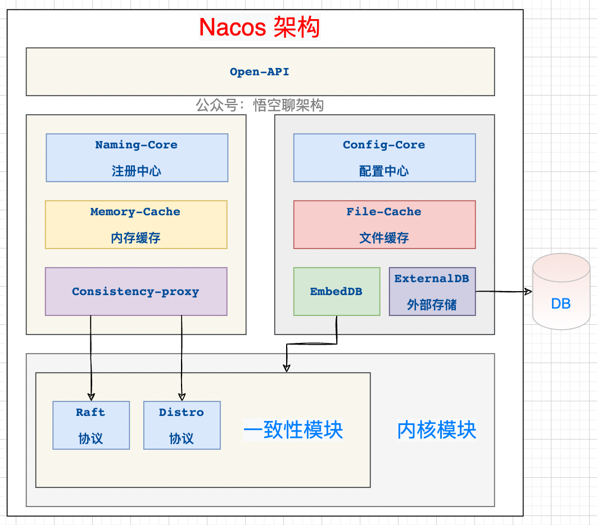
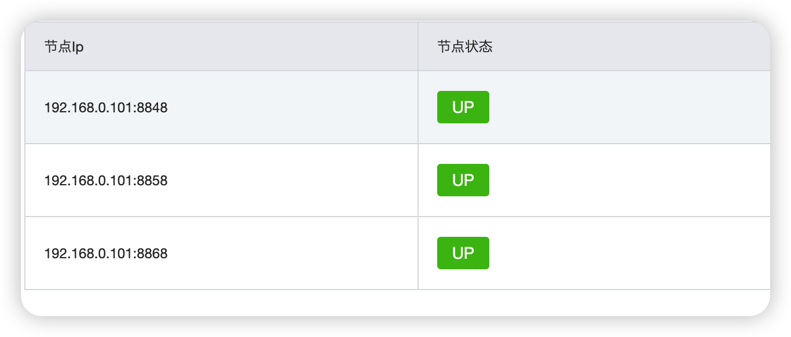
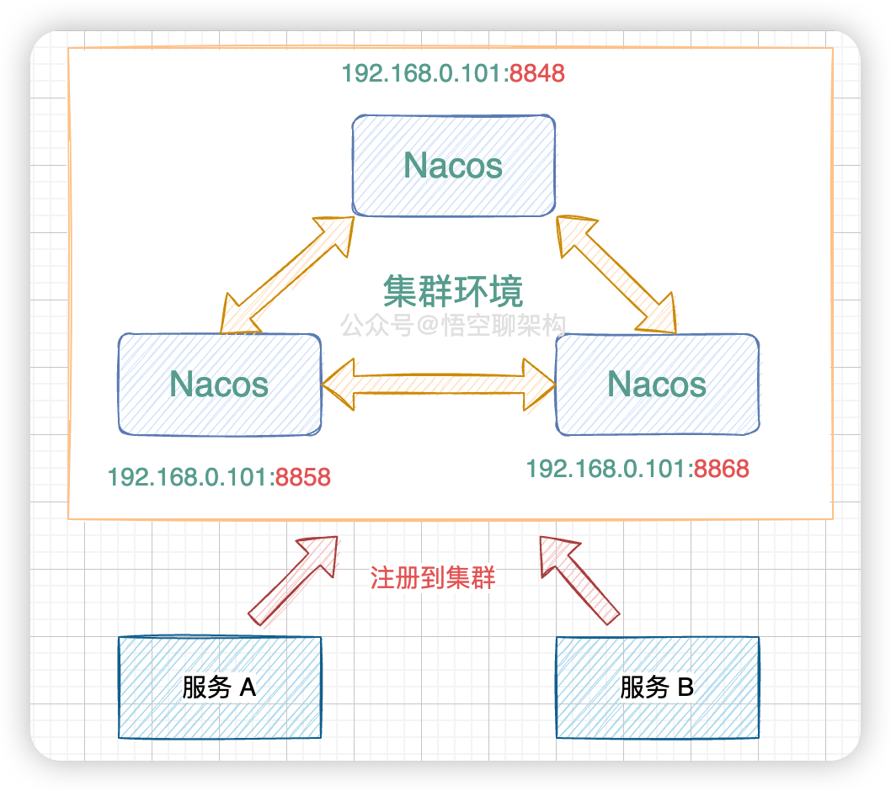
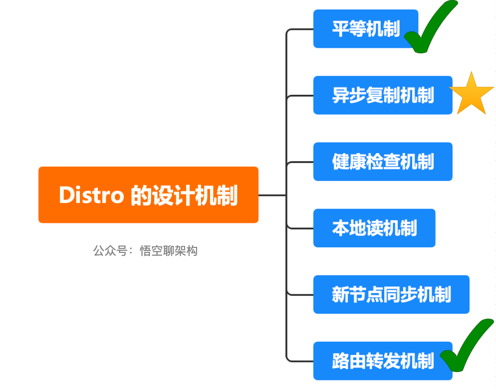
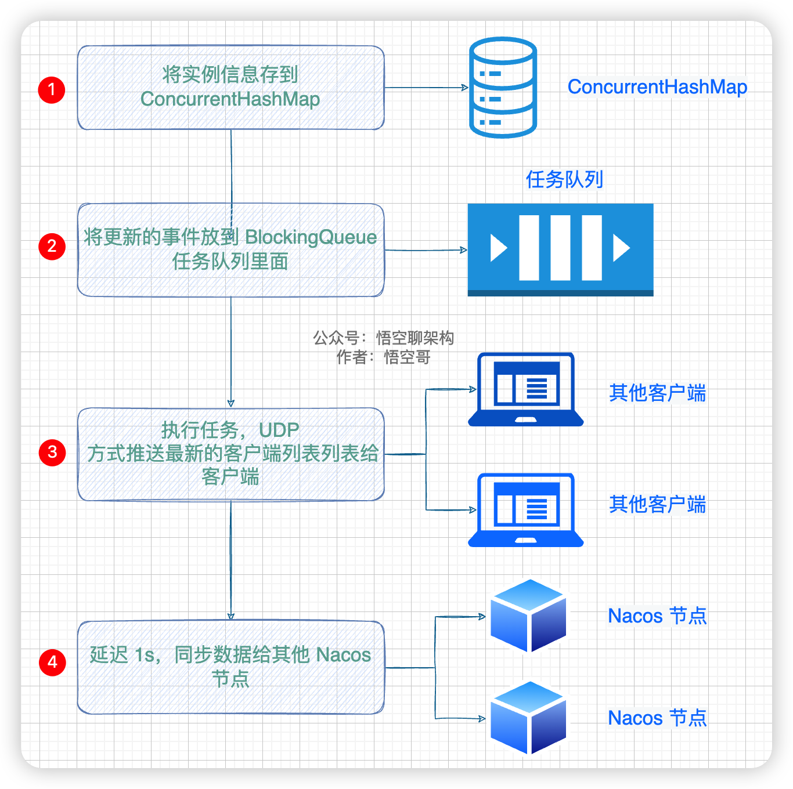
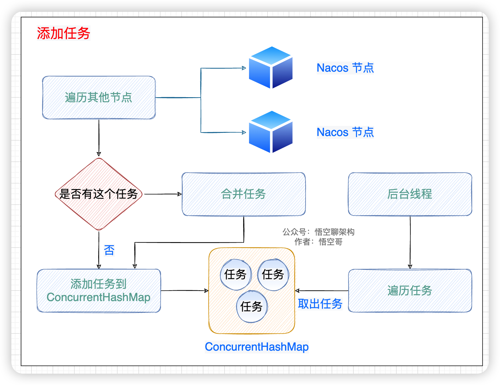
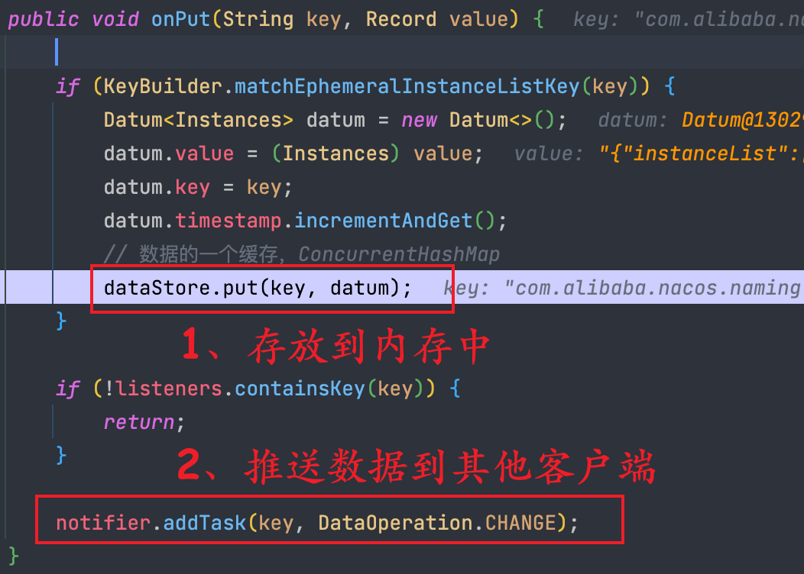
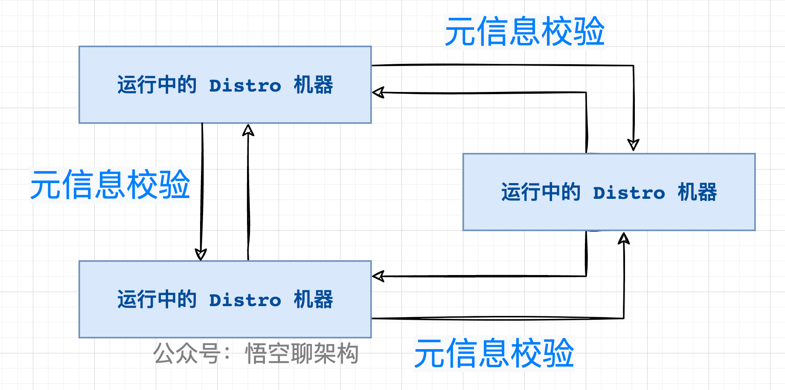
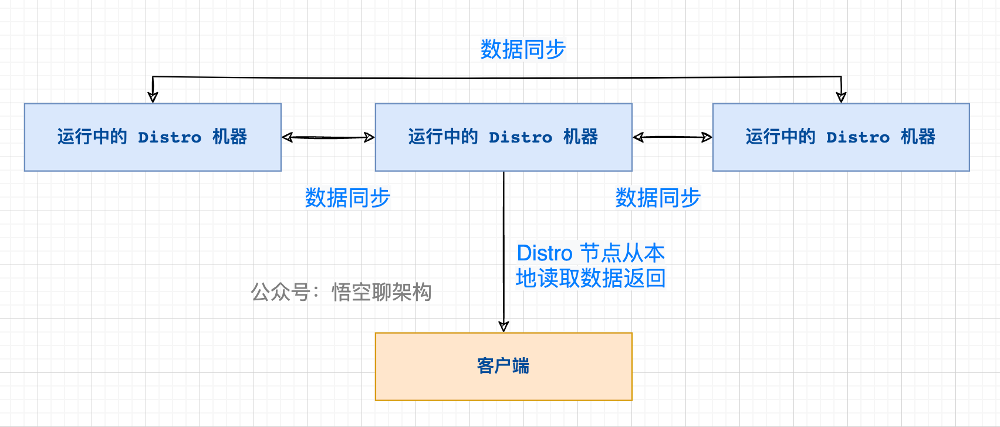

转载且编辑自[Nacos 的 Distro 一致性协议](http://www.passjava.cn/#/13.SpringCloud架构剖析/07.Nacos配置注册中心/03.Nacos架构原理②：揭秘AP架构——Distro一致性协议)

# Nacos 的 Distro 一致性协议

## 前言

这次我们进入 Nacos 的一致性底层原理，还是先来一张架构图，让大家对 Nacos 的架构有个整体的映像，本篇会主要讲解**一致性模块**中的 `Distro` 协议。（本图参考的 Nacos 官方图）



**上篇留了两个知识点**：

- ① 服务实例注册到 Nacos 节点后，通过 UDP 方式推送到所有服务实例。让其他服务实例感知到服务列表的变化。
- ② 如何复制数据到其他节点：当前 Nacos 节点开启 1s 的延迟任务，将数据同步给其他 Nacos 节点。（分区一致性）

第 ② 个知识点就是 Nacos 自研的 `Distro` 一致性协议的核心功能。

首先这个 Distro 协议是针对集群环境的，比如下面这三个集群节点组成了一个集群。服务 A 和服务 B 会往这个集群进行注册。





我们知道 Nacos 它是支持两种分布式定理的：`CP`（分区一致性）和 `AP`（分区可用性） 的，而 AP 是通过 Nacos 自研的 `Distro` 协议来保证的，CP 是通过 Nacos 的 `JRaft` 协议来保证的。

因为注册中心作为系统中很重要的的一个服务，需要尽最大可能对外提供可用的服务，所以选择 AP 来保证服务的高可用，另外 Nacos 还采取了心跳机制来自动完成服务数据补偿的机制，所以说 Distro 协议是弱一致性的。

如果采用 CP 协议，则需要当前集群可用的节点数过半才能工作。

关于 CP 和 AP 的理论知识，可以参考这篇：[用太极拳讲分布式理论 CAP 和 BASE，真舒服！](https://mp.weixin.qq.com/s?__biz=MzAwMjI0ODk0NA==&mid=2451950422&idx=1&sn=7f86457acedbd0853cbcb7dc4377dd54&chksm=8d1c32c9ba6bbbdfd3d8c698addfb13a02589409bdf6a03a777e9afc95249018293d9a9e0a3f&token=203503668&lang=zh_CN#rd)

> 问题：Nacos 中哪些地方用到了 AP 和 CP？

- 针对`临时服务`实例，采用 `AP` 来保证注册中心的可用性，`Distro` 协议。
- 针对`持久化服务`实例，采用 `CP` 来保证各个节点的强一致性，`JRaft` 协议。（JRaft 是 Nacos 对 Raft 的一种改造）
- 针对`配置中心`，无 Database 作为存储的情况下，Nacos 节点之间的内存数据为了保持一致，采用 `CP`。Nacos 提供这种模式只是为了方便用户本机运行，降低对存储依赖，生产环境一般都是通过外置存储组件来保证数据一致性。
- 针对`配置中心`，有 Database 作为存储的情况下，Nacos 通过持久化后通知其他节点到数据库拉取数据来保证数据一致性，另外采用读写分离架构来保证高可用，所以这里我认为这里采用的 `AP`，欢迎探讨。
- 针对 `异地多活`，采用 `AP` 来保证高可用。

弦外音：

**临时服务实例**就是我们默认使用的 Nacos 注册中心模式，客户端注册后，客户端需要定时上报心跳进行服务实例续约。这个在注册的时候，可以通过传参设置是否是临时实例。

**持久化服务实例**就是不需要上报心跳的，不会被自动摘除，除非手动移除实例，如果实例宕机了，Nacos 只会将这个客户端标记为不健康。

本篇会带着大家从源码角度来深入剖析下 Distro 协议。

**知识点预告：**

- ① Distro 的设计思想和六大机制。
- ② Nacos 如何同步数据到其他节点。（异步复制机制，本篇重点讲解）
- ③ Nacos 如何保证所有节点的数据一致性。（定期检验；健康检查机制，下一篇重点讲解）
- ④ 新加入的 Nacos 节点，如何拉取数据。（新节点同步机制）

## 一、Distro 的设计思想和六大机制

`Distro` 协议是 Nacos 对于`临时实例数据`开发的一致性协议。

Distro 协议是集 Gossip + Eureka 协议的优点并加以优化后出现的。

关于 Gossip 协议，可以看这篇：[病毒入侵：全靠分布式 Gossip 协议](https://mp.weixin.qq.com/s?__biz=MzAwMjI0ODk0NA==&mid=2451951238&idx=1&sn=a0acccbdfed3d3ac9ee8ef4bb349b12b&chksm=8d1c3719ba6bbe0fc42876088a0747d7ca68dbbe9d21a21b2c94ecfc62c3f42ae3710f8acb40&token=203503668&lang=zh_CN#rd)

**Gossip 协议有什么坑？**由于随机选取发送的节点，不可避免的存在消息重复发送给同一节点的情况，增加了网络的传输的压力，给消息节点带来额外的处理负载。

**Distro 协议的优化：**每个节点负责一部分数据，然后将数据同步给其他节点，有效的降低了消息冗余的问题。

关于临时实例数据：临时数据其实是存储在`内存缓存`中的，并且在其他节点在启动时会进行全量数据同步，然后节点也会定期进行数据校验。

大家不要被这个协议吓到，其实就是阿里自己实现的一套同步逻辑。

AP 中的 P 代表网络分区，所以 Distro 在分布式集群环境下才能真正发挥其作用。它保证了在多个 Nacos 节点组成的 Nacos 集群环境中，当其中某个 Nacos 宕机后，整个集群还是能正常工作。

**Distro 的设计机制**：

- **平等机制**：Nacos 的每个节点是平等的，都可以处理写请求。（上一讲已经重点讲解了✅）
- **异步复制机制**：Nacos 把变更的数据异步复制到其他节点。(⭐️**重点讲解**)
- **健康检查机制**：每个节点只存了部分数据，定期检查客户端状态保持数据一致性。
- **本地读机制**： 每个节点独立处理读请求，及时从本地发出响应。
- **新节点同步机制**： Nacos 启动时，从其他节点同步数据。
- **路由转发机制**：客户端发送的写请求，如果属于自己则处理，否则路由转发给其他节点。（上一讲已经重点讲解了✅）



## 二、异步复制机制：写入数据后如何同步给其他节点

### 2.1 核心入口

核心源码路径：

```PYTHON
/naming/consistency/ephemeral/distro/DistroConsistencyServiceImpl.java
```

这个类的名字就说明它是 Distro 一致性协议的接口实现类。

当注册请求交给 Nacos 节点来处理时，核心入口方法就是 put()，如下图所示：


上一讲我们已经说过，这里面会做几件事：



- ① 将实例信息存放到内存缓存 concurrentHashMap 里面。
- ② 添加一个任务到 BlockingQueue 里面，这个任务就是将最新的实例列表通过 UDP 的方式推送给所有客户端（服务实例），这样客户端就拿到了最新的服务实例列表，缓存到本地。
- ③ 开启 1s 的延迟任务，将数据通过给其他 Nacos 节点。

**说明**：第二件事是 Nacos 和 客户端如何保持数据一致性的，第三件事是 Nacos 集群间如何保持数据一致性的，因本篇重点讲解 Nacos 的 AP 原理，所以会针对第三件事来进行阐述。而第二件事，会在后续文章中重点讲解。

### 2.2 sync 方法的参数说明

首先我们来看下 distroProtocol.sync()，这个方法传了哪些参数：

- 第一个参数 new DistroKey()，它里面传了 key 和一个常量。

key：就是客户端的服务名，示例值如下：

```JAVA
com.alibaba.nacos.naming.iplist.ephemeral.public##DEFAULT_GROUP@@nacos.naming.serviceName
```

INSTANCE_LIST_KEY_PREFIX：就是 com.alibaba.nacos.naming.iplist.

然后这两个参数组装成一个 DistroKey。

- 第二个参数是同步数据的类型，这里为 change。

- 第三个参数是同步任务的延迟时间，1s。

### 2.3 sync 的核心逻辑：添加任务

先上一张原理图帮助大家理解，流程图如下所示。核心逻辑分为以下几步。

- 遍历其他节点，拿到节点信息。
- 判断这个任务在 map 中是否存在，如果存在则合并这个 task。
- 如果不存在，则加到 map 中。
- 后台线程遍历这个 map，拿到任务。



代码时序图如下所示：


- 第一个类 `DistroConsistencyServiceImpl` 把实例信息加入 map 中，后续通过 `UDP`方式推送给客户端。

- 第二个类 `DistroProtocol` 主要就是**循环遍历**其他节点。

- 第三个类 `NacosDelayTaskExecuteEngine` 是核心类，创建了一个同步的任务到 `ConcurrentHashMap` 中。

### 2.4 sync 的核心逻辑：后台线程异步复制数据

先说下哈，这个核心逻辑极其复杂，我们看的时候需要抓主线，知道其中几个关键点就可以了。

悟空在画代码逻辑图的时候，内心是崩溃的，Nacos 为什么写这么复杂啊！**大家不用细看，看了也会懵😳，理解核心步骤就可以了。**（图中有个小细节，我对不同的类进行了颜色区分）

**核心步骤**：

- 遍历其他节点，创建一个同步的任务，加到 map 中。

- 后台线程不断从 map 中拿到 task，然后移除这个 task。

- 把这个 task 加到一个队列里面。

- 有个 worker 专门从队列里面拿到 task 来执行。

- 这个 task 就是发送 http 请求给其他节点，请求参数中包含注册的实例信息（序列化后的二进制数据）。拼接的请求 url 地址为：

  ```PHP
  http://192.168.0.101:8858/nacos/v1/ns/distro/datum
  ```

Nacos 异步复制数据到其他节点的流程图如下：


### 2.5 其他节点如何处理同步请求

#### 2.5.1 如何存储注册信息

处理同步请求的逻辑还是比较简单的，就是把注册信息存起来，然后同步到其他客户端。

注册信息会存放到一个 `datum` 中，然后 datum 放到一个 `dataStore` 中。datum 和 dataStore 的数据结构如下图所示：

- datum 包含 value、key、timestamp。value 就是注册的客户端信息（是一个 ArrayList）

- datastore 是一个 ConcurrentHashMap，包含多个 datum。


#### 2.5.2 源码分析

根据 2.4 讲到的请求的 URL：`/nacos/v1/ns/distro/datum`，处理这个请求的类为

```
com/alibaba/nacos/naming/controllers/DistroController.java
```

入口方法为 `onSyncDatum`，里面做的主要事情如下：

- ① 把实例信息放入到一个 datum 内存中，然后又存放到 DataStore 的结构中，而 DataStore 的本质就是一个 `ConcurrentHashMap`。

- ② 将注册信息通过 UDP 的方式推送给客户端。



## 	三、定时同步：如何保持数据一致性

### 3.1 为什么需要定时同步

在 Nacos 集群模式下，它作为一个完整的注册中心，必须具有高可用特性。

在集群模式下，客户端只需要和其中一个 Nacos 节点通信就可以了，但是每个节点其实是包含所有客户端信息的，这样做的好处是每个 Nacos 节点只需要负责自己的客户端就可以（分摊压力），而当客户端想要拉取全量注册表到本地时，从任意节点都可以读取到（数据一致性）。

那么 Nacos 集群之间是如何通过 Distro 协议来保持数据一致性的呢？ 

### 3.2 定期检验元数据

在版本 v1 中 ，采用的是定期检验元信息的方式。元信息就是当前节点包含的客户端信息的 md5 值。

检验的原理如下图所示：



> Nacos 各个节点会有一个心跳任务，定期向其他机器发送一次数据检验请求，在校验的过程中，当某个节点发现其他机器上的数据的元信息和本地数据的元信息不一致，则会发起一次全量拉取请求，将数据补齐。

请求 URL:

```python
http://其他 Nacos 节点的 IP:port/nacos/v1/ns/distro/checksum?source = 本机的IP地址:本机的端口号
```

参数：DistroData，内部包装的是一个Map<服务名称，服务下实例的验证字符串 checksum>

### 3.3 关于版本迭代的说明

在版本  v2 中，定期校验数据已经不用了，采用的是`健康检查机制`，来和其他节点来保持数据的同步，由于涉及的内容还挺多，放到下一讲来专门讲解 Nacos 的健康检查机制：

- 客户端与 Nacos 节点的健康检查机制。
- 集群模式下的健康检查机制。

## 四、新节点同步机制，如何保持数据一致性

### 4.1 原理

新加入的 Distro 节点会进行全量数据拉取，轮询所有的 Distro 节点，向其他节点发送请求拉取全量数据。

在全量拉取操作完成之后，每台机器上都维护了当前的所有注册上来的非持久化实例数据。（参考 Nacos 官方图）


### 4.2 源码分析

`DistroProtocol` 类的构造方法会启动一个同步任务，从其他 Nacos 节点全量拉取非持久化实例数据。

```java
/nacos/core/distributed/distro/DistroProtocol.java
	startDistroTask();
		startLoadTask();
/nacos/core/distributed/distro/task/load/DistroLoadDataTask.java
	run();
		load();
			loadAllDataSnapshotFromRemote();
```

### 五、本地读机制

### 5.1 原理

每个 Nacos 节点虽然只负责属于自己的客户端，但是每个节点都是包含有所有的客户端信息的，所以当客户端想要查询注册信息时，可以直接从请求的 Nacos 的节点拿到全量数据。（参考 Nacos 官方图）



这样设计的好处是保证了高可用（AP），分为两个方面：

- ① 读操作都能进行及时的响应，不需要到其他节点拿数据。
- ② 当脑裂发生时，Nacos 的节点也能正常返回数据，即使数据可能不一致，当网络恢复时，通过健康检查机制或数据检验也能达到数据一致性。

## 六、总结

本篇通过原理图 + 源码的方式讲解了 Distro 协议的原理，其中又分为几个机制，而这几个机制共同保证了 Nacos 的 AP。

不足之处，本篇未针对源码的设计进行深入剖析，只是把主线捋出来了。


